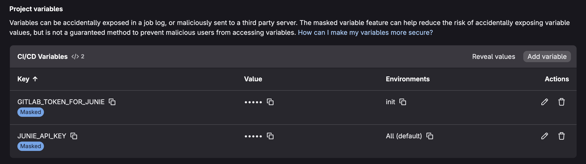
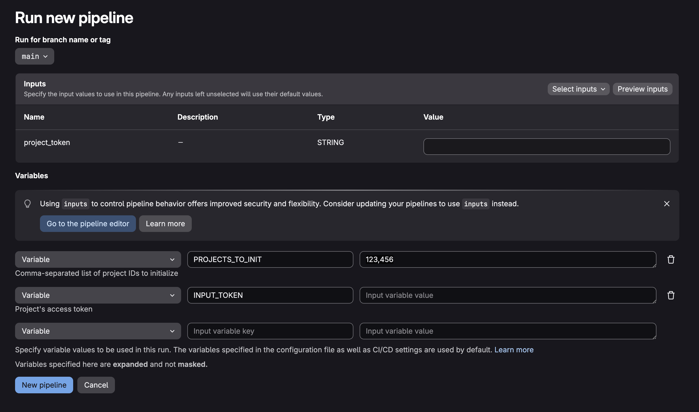

# GitLab CLI Wrapper

Wrapper for Junie CLI for GitLab environment.

## Setup

To use Junie in your instance of GitLab, you need to set up a separate GitLab project for it.

Let's do that step-by-step:

1. Create a new project, e.g. "Junie Workspace"
2. In the CI/CD settings you need to create two new variables:
   1. `JUNIE_API_KEY` with an auth token for Junie (usually starts with `perm-`)
   2. `GITLAB_TOKEN_FOR_JUNIE` a "master" token for GitLab that will be used for automated projects initialization. It must have enough permissions to manage other projects (e.g. to create new webhooks and to generate project access tokens) and to create new trigger tokens in this new Junie's project. *⚠️ Please limit this variable visibility to `init` environment only, so that it will be used for pipelines initialization and cleanup only and will NOT leak to pipelines created for actual Junie jobs.*
      
3. Copy the [.gitlab-ci.yml](./script-sample.yaml) file from this repository to the root of the new project in a default branch.

Then you need to "initialize" projects that will use Junie.
Initialization means that for such a project:

1. A new webhook will be created that will trigger a pipeline with Junie in the Junie Workspace project.
2. A new project-level access token will be generated and stored in the project's settings. Every new pipeline in the Junie Workspace project will be triggered with this token.
3. A new trigger token for Junie Workspace project will be generated and stored in the newly created webhook parameters.

The good news is that you can initialize projects automatically!
In the Junie Workspace project, open the "Pipelines" tab and create a new one by clicking "New pipeline."
At this step it will ask you to enter the `PROJECTS_TO_INIT` variable – just paste a comma-separated list of projects IDs to initialize (ignore other suggested inputs) and run it:

After successful completion, all the needed webhooks and tokens will be created automatically for requested projects.

## Usage Examples & Recipes

After completing the setup, check out the [COOKBOOK.md](./COOKBOOK.md) for ready-to-use examples:
- 🚀 **Basic Interactive Setup** - Respond to `#junie` mentions in MRs and issues
- 🔍 **Automated Code Review** - Automatic or on-demand code reviews with inline comments
- 🔧 **CI Failure Analysis (fix-ci)** - On-demand analysis and automatic fixing of failed pipelines
- 🛠️ **Minor Fix Requests (minor-fix)** - Make small, focused changes to MRs with specific instructions
- 📚 **Real-world recipes** - Copy-paste configurations for common workflows

### Additional parameters

For the stage `junie-run` you can also set the following environment variables to customize the behavior:

| Variable                       | Default value   | Description                                                                 |
|--------------------------------|-----------------|-----------------------------------------------------------------------------|
| `JUNIE_VERSION`                | `null`          | Version of Junie CLI to use. If is not set – the latest one will be used    |
| `JUNIE_MODEL`                  | `null`          | Specific Junie model to use (e.g., `claude-sonnet-4-5-20250929`)            |
| `JUNIE_GUIDELINES_FILENAME`    | `guidelines.md` | Filename of the guidelines file (should be in `<project-root>/.junie` dir)  |
| `USE_MCP`                      | `true`          | Enable GitLab MCP tools for inline code review comments                     |

## Commands

### `init`

Initializes Junie CLI in the repositories specified as command line arguments (comma-separated).
For every requested project this job will generate a new webhook that triggers a pipeline with Junie in the Junie Workspace project, generate a new trigger-token for Junie Workspace project and create a new project-level access token for Junie CLI to use in a pipeline.
Normally it must be executed once per repository.

**Options:**
- `-V, --verbose` - Enable debug logging (default: false)

### `run`

Run Junie CLI.

**Options:**
- `-C, --cleanup` - Auto clean-up (delete finished jobs) after idle run (default: false)
- `-V, --verbose` - Enable debug logging (default: false)
- `-p, --prompt <prompt>` - Custom prompt for Junie execution
- `-M, --mr-mode <mode>` - Merge requests processing mode (choices: "append", "new", default: "new")
  - `append` - Append to existing merge requests by pushing changes to the same branch
  - `new` - Create new merge requests

**Code Review Feature:**

To trigger code review, you can either:
1. **Manual trigger**: Write `#junie code-review` in a comment to a merge request (requires `junie-init` to be run first)
2. **Automatic trigger**: Configure a separate CI/CD job that runs on every MR update

When the "code-review" phrase is detected, Junie will:
- Get the Merge Request diff
- Review the code according to repository style and best practices
- Post inline comments with suggestions using GitLab MCP tools (if available)
- Provide a comprehensive review summary

**CI Failure Analysis (fix-ci) Feature:**

To trigger CI failure analysis:
- **Manual trigger**: Write `#junie fix-ci` in a comment on an MR with failed tests (requires `junie-init` to be run first)

When "fix-ci" is triggered, Junie will:
- Find the most recent failed pipeline for the MR
- Analyze failed job logs to identify error messages and stack traces
- Determine the root cause (test failure, build error, lint issue, etc.)
- Correlate failures with MR changes
- Suggest specific fixes with code snippets

## Documentation

- **[COOKBOOK.md](./COOKBOOK.md)** - Ready-to-use recipes and examples for common workflows
- **[script-sample.yaml](./script-sample.yaml)** - Complete CI/CD configuration template

## Need Help?

- 📘 Check the [Cookbook](./COOKBOOK.md) for examples *(NEED TO BE UPDATED)*
- 🐛 Report issues in the project's issue tracker
- 💬 Mention `#junie` in any MR or issue for interactive assistance
